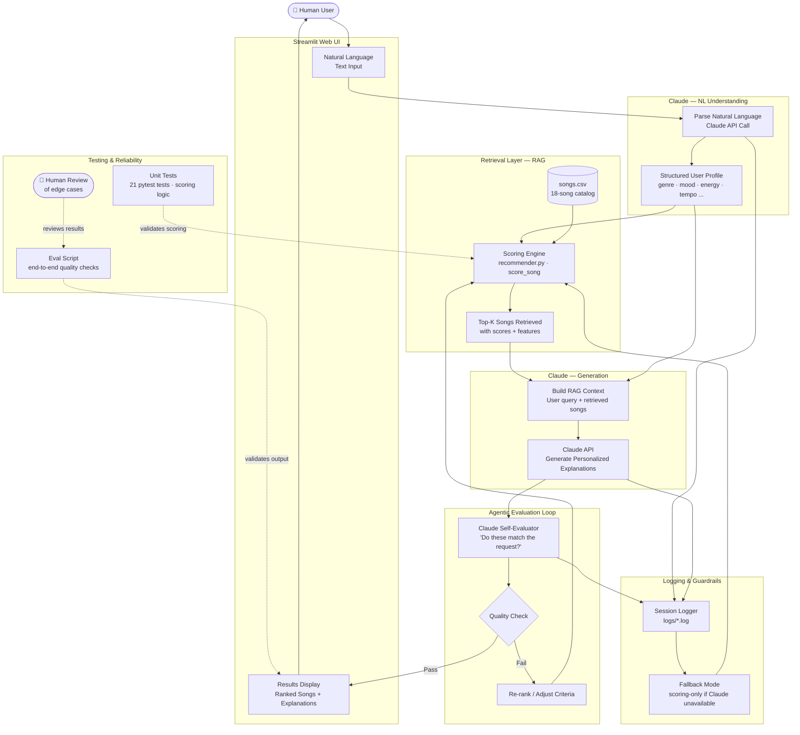

# Author Explanation of Project:

My original project which was the CLI version of the music recommender was CLI based with the same scoring logic and ranking as used now. The goal was to making a working CLI prototype music recommender, which I accomplished. The recommender required specific Python commands and changes to the user profile, no plain-text requests were a thing.

Title: Music4u - Angelo's AI Music Recommender

My project is an extension to the original CLI version of my music recomender, utilizing streamlit for its UI. It contains a plain-text English input box where a user can ask for a specific mood such as, "Songs that get me hype for the gym," and will recomnmend songs accordingly. RAG is included, with the AI retrieval first parsing songs and its data before giving its recommendation. Disclaimer, the program is supposed to use Claudes API key to recommend songs based on input, but it is a paid service. Because of this, my program does not use it and as part of the program implementation it switches back to the original algorithmic scoring. This project matters because people need a simple and easy way to recommend songs that they want to listen to specifically, and it should be easy to ask for and have instant results.

For the architecture, the program starts with a user input with plain english. The input then goes to either the API or the algorithmic scoring, in whichever case it goes into the scoring engine to score each song, where it has a RAG as well of songs.csv to go into the engine. Top K Songs are retrieved with its data and build the context, then an agentic evaluation checks if the songs listed match the request. If not then its adjusted and if it is then the results are displayed to the user. There are unit tests as well testing the scoring engine.

Setup:
```bash
# 1. Clone the repo
git clone <repo-url>
cd applied-ai-music-recommender-project

# 2. Create a virtual environment
python -m venv .venv
source .venv/bin/activate  # Windows: .venv\Scripts\activate

# 3. Install dependencies
pip install -r requirements.txt

# 4. Set your Anthropic API key
export ANTHROPIC_API_KEY=your_key_here

# 5. Run the Streamlit app
streamlit run src/app.py

# 6. Or run the CLI demo
python src/main.py

# 7. Run tests
pytest tests/
```

Sample interactions: 
"hype songs for a workout"
output: #1
Iron Curtain
Gravewarden
7.37 / 7.5 ⚡ Algorithmic
metal angry
"genre match (metal) · mood match (angry) · energy 0.97 vs target 0.95 · danceability 0.55 vs target 0.6"
#2
Storm Runner
Voltline
4.10 / 7.5 ⚡ Algorithmic
rock intense
"energy 0.91 vs target 0.95 · danceability 0.66 vs target 0.6"
#3
Gym Hero
Max Pulse
3.68 / 7.5 ⚡ Algorithmic
pop intense
"energy 0.93 vs target 0.95 · danceability 0.88 vs target 0.6"
#4
Night Drive Loop
Neon Echo
3.59 / 7.5 ⚡ Algorithmic
synthwave moody
"energy 0.75 vs target 0.95 · danceability 0.73 vs target 0.6"
#5
Block Party Anthem
Drez Malik
3.47 / 7.5 ⚡ Algorithmic
hip-hop hype
"energy 0.88 vs target 0.95 · danceability 0.91 vs target 0.6"

"sad songs for me to cry to"
#1
Candle and Rain
Morrow Folk
7.33 / 7.5 ⚡ Algorithmic
folk sad
"genre match (folk) · mood match (sad) · energy 0.31 vs target 0.35 · danceability 0.38 vs target 0.35"
#2
Library Rain
Paper Lanterns
4.00 / 7.5 ⚡ Algorithmic
lofi chill
"energy 0.35 vs target 0.35 · danceability 0.58 vs target 0.35"
#3
Echoes of Autumn
Clara Voss
3.98 / 7.5 ⚡ Algorithmic
classical melancholic
"energy 0.22 vs target 0.35 · danceability 0.24 vs target 0.35"
#4
Spacewalk Thoughts
Orbit Bloom
3.96 / 7.5 ⚡ Algorithmic
ambient chill
"energy 0.28 vs target 0.35 · danceability 0.41 vs target 0.35"
#5
Coffee Shop Stories
Slow Stereo
3.85 / 7.5 ⚡ Algorithmic
jazz relaxed
"energy 0.37 vs target 0.35 · danceability 0.54 vs target 0.35"

Design Decisions:
I built it this way to stay simple yet be a powerful recommender which works easily for anybody. Some trade offs I made were not using the Claude API because of the paywall and instead opting for the original algorithming scoring AI.

Testing summary:
What worked was all of the pytests, which valided the scoring engine with all of its parameters effectively. The scores were all correct, as well as its validation of all of the scores as well. 

What did not work was mostly UI problems. For one, the padding on the top of the screen was nonexistent at first, cutting off the design of the website from the top. This was fixed quickly. 

What I learned through this project and its testing was RAG in practice (generation quality is only as good as the data it is given), agentic eval having cost (Claude API), and a fallback design being necessary for a AI wrapped project like this. 

Reflection:
I learned a great deal about AI and problem solving through this project. I learned that having a CLI version of your app first is essential to checking the logic of the program, and making sure it is making sense in its barebones form. Afterward, making the UI component was easy and efficient. I learned that problems were to be expected in writing software and working on codebases, and that fixing them and understanding why they happened in the first place is extremely valuable. I hope to extend this project to real users possibly one day, and extending this project was fun and taught me a great deal about AI Engineering for sure. 

Limitations and biases:
The catalog has only 18 hand picked songs, introducing curator bias. The data in each song reflects the choice done by the programmer instead of any actual music. Scoring weights  (such as genre +2.0, mood +1.0) were manually tuned rather than learned from user data.

Could it be misused?
Probably not. However, a big possible exploitation is the Claude API version of this project, where the main input is sent directly to the API. Any person can write whatever they want to the input which goes to the backbone of the system, which can possibly be a problem to the ouput or worse. 

What surprised me while testing AI reliability:
The agentic evaluation loop almost always returns pass: True. Meaning that in testing, reranking of the output list was rarely triggered. So this step may be redundent, however, we can not fully test this feature out without the paid Claude API.

Collaboration with AI:
Working with Claude on this project helped immensely writing boilerplate code and helped me get straight to the main function of this program originally. I helped it draft me ideas on what to add to the project, as well as testing and backups for each feature. It also made the diagram for me that I already envisioned in my head of the project, which saved hours of work. I used it as the copilot and assistant to my project, being able to work on the main ideas specifically and focus on design of the app and its sytem, rather than trivial things.

Testing:

pytest tests/

18 out of 18 tests passed. The AI uses the context effectively and matches each song ranking with the correct genre and data from RAG.


# Music4u — AI Music Recommender

An AI-powered music recommendation system that combines a deterministic scoring engine with Claude LLM for natural language understanding, retrieval-augmented generation (RAG), and agentic self-evaluation.

---

## System Architecture



---

## Data Flow Summary

| Step | Component | What Happens |
|------|-----------|--------------|
| 1 | **Human User** | Types a natural language request |
| 2 | **Streamlit UI** | Accepts input, displays final results |
| 3 | **Claude NLU** | Parses text → structured preference profile |
| 4 | **Scoring Engine** | Scores all 18 songs against the profile |
| 5 | **RAG Retrieval** | Top-K songs retrieved with features |
| 6 | **Claude Generation** | Uses retrieved songs to write explanations |
| 7 | **Claude Evaluator** | Self-checks if recommendations fit the request |
| 8 | **Quality Check** | Pass → display · Fail → re-rank and retry |
| 9 | **Logger** | Records every API call, score, and error |
| 10 | **Fallback** | Scoring-only mode if Claude is unavailable |

---

## Advanced AI Features

| Feature | Implementation |
|---------|---------------|
| **RAG** | Song catalog retrieved before Claude generates explanations |
| **Agentic Workflow** | Claude evaluates its own output and triggers re-ranking if needed |
| **Logging & Guardrails** | All sessions logged; fallback to scoring-only on API failure |
| **Reliability Testing** | Unit tests (scoring math) + eval script (end-to-end) + human review |

---

## Setup

```bash
# 1. Clone the repo
git clone <repo-url>
cd applied-ai-music-recommender-project

# 2. Create a virtual environment
python -m venv .venv
source .venv/bin/activate  # Windows: .venv\Scripts\activate

# 3. Install dependencies
pip install -r requirements.txt

# 4. Set your Anthropic API key
export ANTHROPIC_API_KEY=your_key_here

# 5. Run the Streamlit app
streamlit run src/app.py

# 6. Or run the CLI demo
python src/main.py

# 7. Run tests
pytest tests/
```
