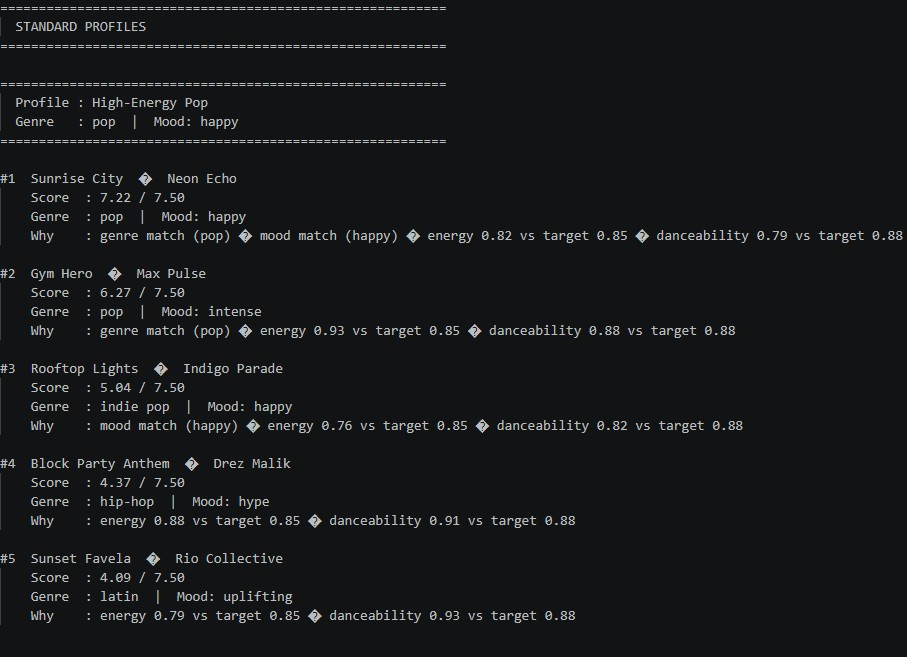
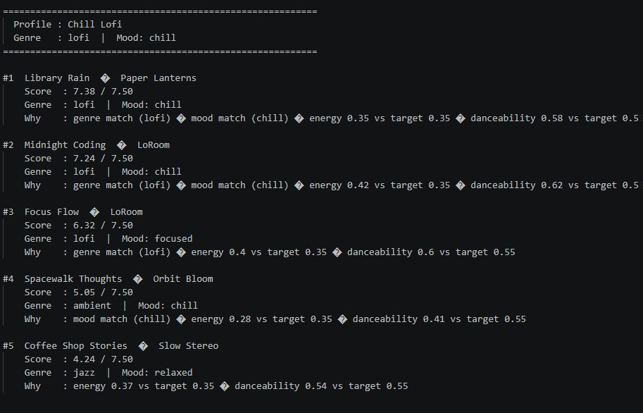
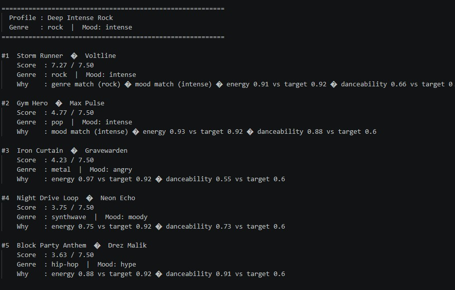
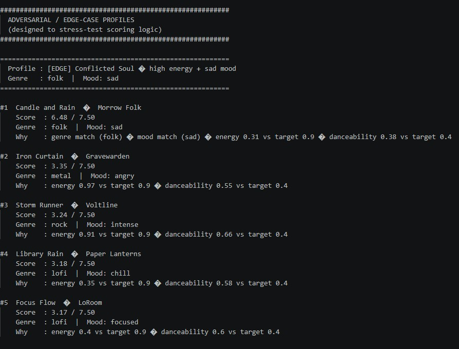
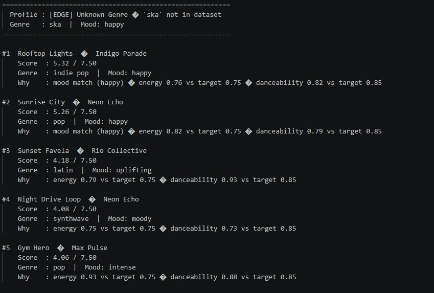

# 🎵 Music Recommender Simulation

## Project Summary

In this project you will build and explain a small music recommender system.

Your goal is to:

- Represent songs and a user "taste profile" as data
- Design a scoring rule that turns that data into recommendations
- Evaluate what your system gets right and wrong
- Reflect on how this mirrors real world AI recommenders

Replace this paragraph with your own summary of what your version does.

---

## How The System Works

Explain your design in plain language.
Real world recommendations work by comparing 2 different attributes to items, one comparison is through each user and what they also like. This is compared to everybody else. The other way it works is by comparing the actual song attributes to different ones, and these 2 comparisons are merged together to form the recommendation system. What my system will do is score songs by their attributes and similarities, and scores that are close together are songs that are going to be recommended along with another song. It score based on attributes like mood, genre, dancibility, etc. The separation of scoring songs and ranking  songs together are separated so that each implementation can be worked on individually. User profile store a score for each song, and compares songs to the users targets which are stored here as well. Choosing a song to recommend, we call score_song for every song in the catalog, sort the songs by descending score order, and return the top k songs. For the algorithm plan, we want data from the users profile and songs profile to compare and score itself over each other, some attributes more than others, and sort the list and return the first 5. Some biases I expect happening is that the system may prioritize numerical values, as it constitutes 60% weight of the scoring done.








Some prompts to answer:

- What features does each `Song` use in your system
  - For example: genre, mood, energy, tempo
- What information does your `UserProfile` store
- How does your `Recommender` compute a score for each song
- How do you choose which songs to recommend

You can include a simple diagram or bullet list if helpful.

---

## Getting Started

### Setup

1. Create a virtual environment (optional but recommended):

   ```bash
   python -m venv .venv
   source .venv/bin/activate      # Mac or Linux
   .venv\Scripts\activate         # Windows

2. Install dependencies

```bash
pip install -r requirements.txt
```

3. Run the app:

```bash
python -m src.main
```

### Running Tests

Run the starter tests with:

```bash
pytest
```

You can add more tests in `tests/test_recommender.py`.

---

## Experiments You Tried

Use this section to document the experiments you ran. For example:

- What happened when you changed the weight on genre from 2.0 to 0.5
- What happened when you added tempo or valence to the score
- How did your system behave for different types of users

---

## Limitations and Risks

Summarize some limitations of your recommender.

Examples:

- It only works on a tiny catalog
- It does not understand lyrics or language
- It might over favor one genre or mood

You will go deeper on this in your model card.

---

## Reflection

Read and complete `model_card.md`:

[**Model Card**](model_card.md)

Write 1 to 2 paragraphs here about what you learned:

- about how recommenders turn data into predictions
- about where bias or unfairness could show up in systems like this


---

## 7. `model_card_template.md`

Combines reflection and model card framing from the Module 3 guidance. :contentReference[oaicite:2]{index=2}  

```markdown
# 🎧 Model Card - Music Recommender Simulation

## 1. Model Name

Give your recommender a name, for example:

> VibeFinder 1.0

Music4u 1.0

## 2. Intended Use

- What is this system trying to do
- Who is it for

Example:

> This model suggests 3 to 5 songs from a small catalog based on a user's preferred genre, mood, and energy level. It is for classroom exploration only, not for real users.

This recomender system suggests about 5 songs from a selection based off users preferred genre, mood, energy, etc. It is mostly for classroom purposes, not for real users.

## 3. How It Works (Short Explanation)


Describe your scoring logic in plain language.

- What features of each song does it consider
- What information about the user does it use
- How does it turn those into a number


The algorithm works by scoring songs based on a users preferred song profile and songs with their attributes. It ranks these songs and their score based on how close they are to the users preferrences, and sorts all of these songs in descending order of score. The top k (usually 5) songs are picked and recommended to the user.

## 4. Data

Describe your dataset.

- How many songs are in `data/songs.csv`
- Did you add or remove any songs
- What kinds of genres or moods are represented
- Whose taste does this data mostly reflect

18 songs are in songs.csv. I added a couple more songs to the original. Some genres represented is rock, pop, lofi, r&b. Some moods are happy, sad, hype, chill, focused, etc. This taste mostly reflects a pop taste as there is mostly pop type songs and the user profile is pop as well.


## 5. Strengths

Where does your recommender work well

You can think about:
- Situations where the top results "felt right"
- Particular user profiles it served well
- Simplicity or transparency benefits

My recommender works well for differentiates similar songs and giving them a concise and accurate ranking for them. It is simple and easy to use, and it served user profiles extremely well.

## 6. Limitations and Bias

Where does your recommender struggle

Some prompts:
- Does it ignore some genres or moods
- Does it treat all users as if they have the same taste shape
- Is it biased toward high energy or one genre by default
- How could this be unfair if used in a real product

Some of the songs dont seem to be right by intuitition, but they are mathematically correct, which is not so much an issue. The real issue is a catalog representation bias, as a genre like lofi has a more differentiated and quality recommendation compared to the other genres other than pop, which is slightly less differentiated. Lofi song matching is more fleshed out and has more songs to recommend to the user.

## 7. Evaluation

How did you check your system

Examples:
- You tried multiple user profiles and wrote down whether the results matched your expectations
- You compared your simulation to what a real app like Spotify or YouTube tends to recommend
- You wrote tests for your scoring logic


I tried multiple user profiles, making sure that the results matched expectations from the songs I already have. I also wrote tests for the scoring logic to make sure the scoring was accurate and expected.

## 8. Future Work

If you had more time, how would you improve this recommender

Examples: 

- Add support for multiple users and "group vibe" recommendations
- Balance diversity of songs instead of always picking the closest match
- Use more features, like tempo ranges or lyric themes

I would improve this recommender for adding other users and being able to recommend songs based on the whole group and all of their attributes combined. Also, I would try to add more features like lyric themes and sharing of recommendations to others.

## 9. Personal Reflection

A few sentences about what you learned:

- What surprised you about how your system behaved
- How did building this change how you think about real music recommenders
- Where do you think human judgment still matters, even if the model seems "smart"

Id say the biggest learning moment I learned during this project is using AI to explain to me a system and algorithm so I could understand it better and give it implementation and features that I wouldnt have thought otherwise. What surprised me about this system is how accurate it was, especially with the various fields that songs could be rated on. AI tools helped me in this learning aspect, but I had to double check the AI when creating actual logic for the app and ideas. I thought real music recommenders were not as complicated as this, and for a 1% version for something like what Spotify uses, I feel that this can pretty accurately rank a lot of songs already. I was surprised this small algorithm still felt like a full fledged recommender. I think human judgement still matters with intuitive grouping of songs in specific genres, as some fields may sway one result and put a song where it really should not be. If i extended this project, I would definitely try to add a group function with real users, with a UI element.
